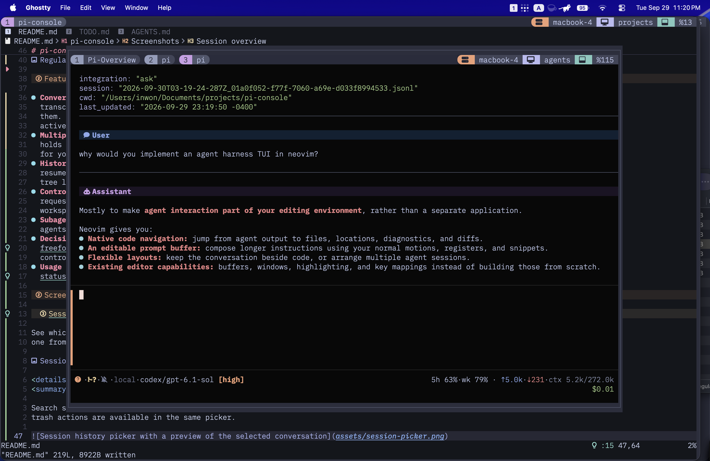
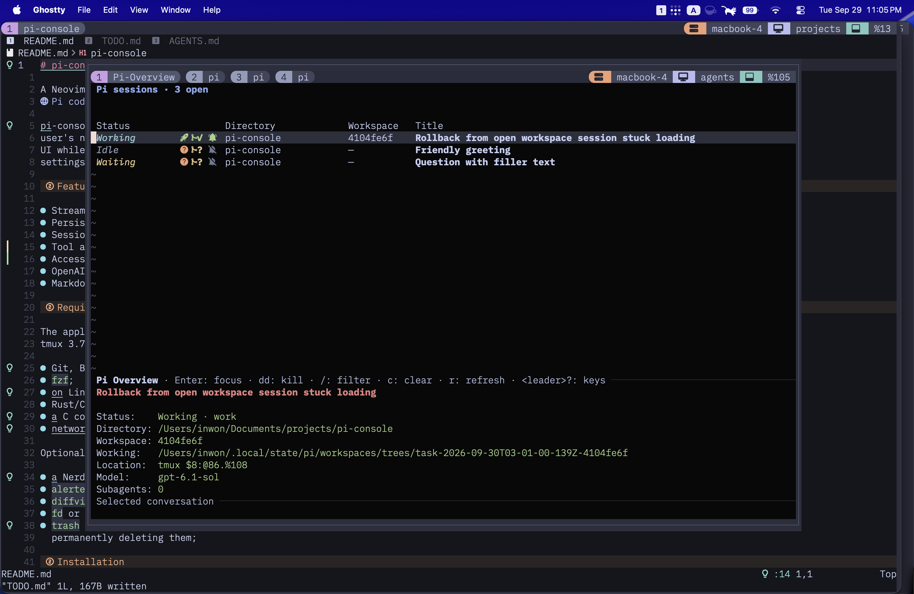
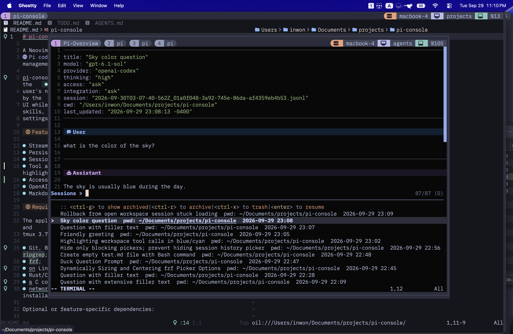
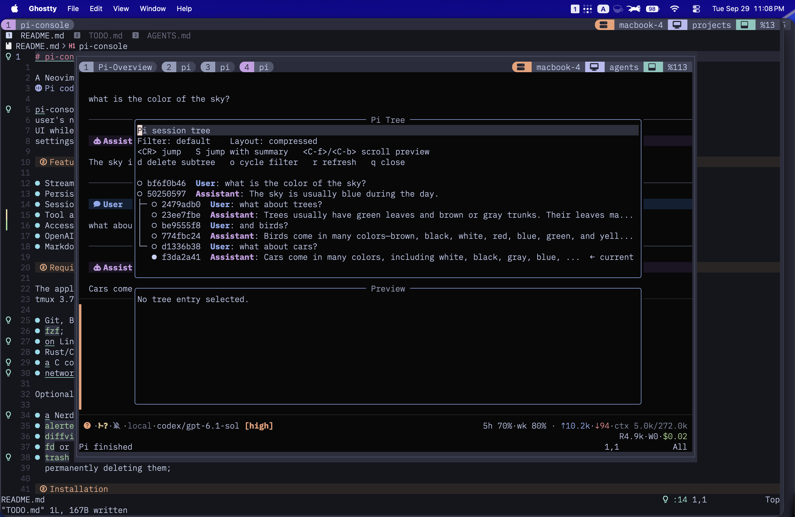
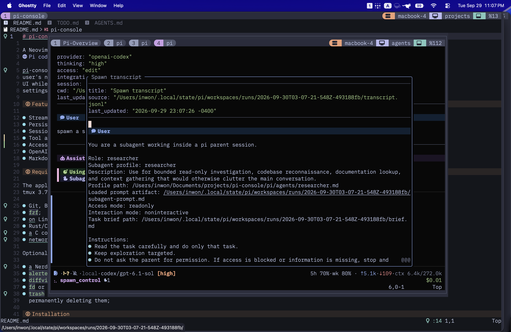
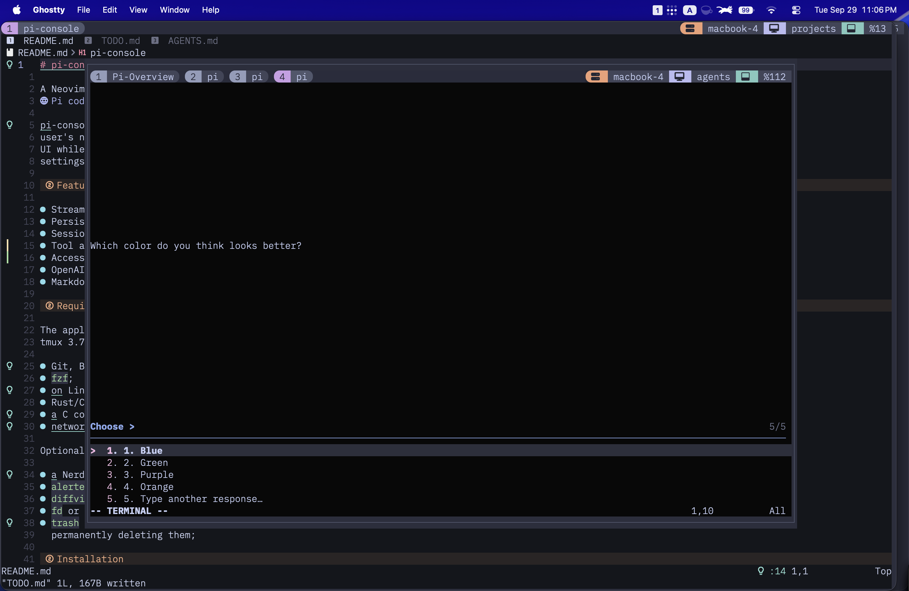
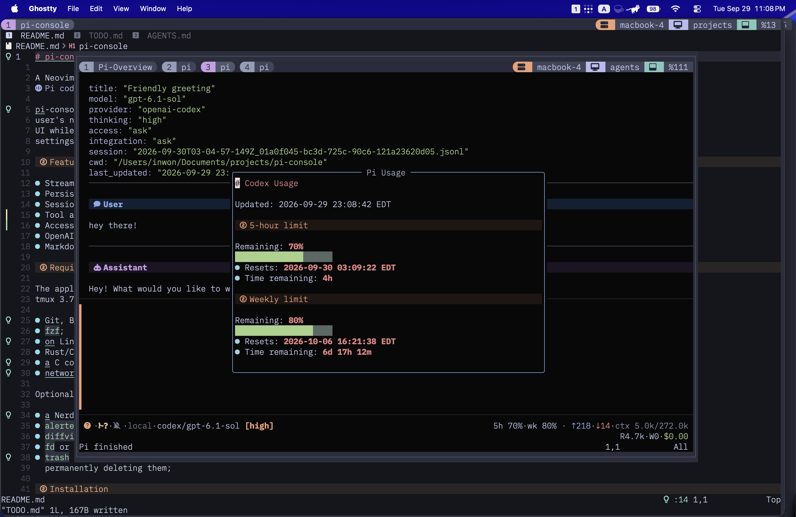

# pi-console

A Neovim frontend for the [Pi coding agent](https://pi.dev), with tmux to keep multiple conversations running and an overview to keep track of them so you no longer need to bounce back and forth between your favorite editor and the TUI.

Your existing Pi credentials, instructions, skills, settings, and packages carry over; the extensions needed by the UI are bundled.

This is a work in progress. The main reason for sharing this repository is to serve as an inspiration for others who want to build something similar. I use this project daily so I will continue to improve/add features, but I do not guarantee that it will be maintained or supported in the future. If you want to use it, please read the requirements and installation instructions carefully (or have your agent do it).



## Features

- **Conversations in Neovim.** Editable Markdown prompts and rendered
  transcripts, with tool output and thinking available to open when you need
  them. Switch models and thinking levels, or send another prompt to steer an
  active run.
- **Multiple sessions without losing your place.** A persistent tmux session
  holds your conversations. The overview shows who's working, idle, or waiting
  for you, along with each session's directory and workspace.
- **History you can navigate.** Fuzzy-find sessions with transcript previews,
  resume old work, and archive, restore, or trash conversations. The session
  tree lets you revisit earlier messages and explore a different branch.
- **Control over agent changes.** Choose an access mode, inspect approval
  requests with highlighted commands and diffs, and work in isolated Git
  workspaces. Review workspace changes before integrating them.
- **Subagents you can follow.** Delegate work to foreground or background
  agents and inspect their transcripts without leaving the parent conversation.
- **Decisions and progress in the UI.** Multiple-choice questions with a
  freeform response option, structured task lists, and desktop notification
  controls.
- **Usage at a glance.** Session token, context, and cost information in the
  statusline, plus OpenAI Codex quota and reset times in a dedicated view.

## Screenshots

### Session overview

See which conversations need attention, check their workspaces, and jump into
one from a single overview.



<details>
<summary>Session picker and transcript preview</summary>

Search saved conversations and read a preview before resuming. Archive and
trash actions are available in the same picker.



</details>

<details>
<summary>Conversation tree</summary>

Navigate conversation branches and jump back to an earlier message, with an
optional summary when switching context.



</details>

<details>
<summary>Subagent transcript</summary>

Open a delegated agent's transcript alongside the parent conversation.



</details>

<details>
<summary>Question picker</summary>

Choose an answer or write your own response when the agent needs a decision.



</details>

<details>
<summary>OpenAI Codex usage</summary>

Check the remaining five-hour and weekly quotas, with reset times.



</details>

## Requirements

The application is currently developed against Neovim 0.12, Pi 0.87.1, and
tmux 3.7. It also requires:

- Git, Bash, curl, Node.js 20.11 or newer, npm, `realpath`, and `ripgrep`;
- `fzf`;
- on Linux, `bubblewrap` and `socat` for OS-enforced command sandboxing;
- Rust/Cargo to build `blink.cmp`;
- a C compiler and parser toolchain for Tree-sitter;
- network access during initial package, plugin, and parser installation.

Optional or feature-specific dependencies:

- a Nerd Font and a true-color terminal for the intended interface;
- `alerter` for desktop notifications, which are currently macOS-only;
- `diffview.nvim` in the regular Neovim configuration used by workspace review (only if you want to view diff from workspace changes)
- `fd` or `fdfind` for faster file completion;
- `trash` or `gio trash` to move deleted sessions to the OS trash instead of
  permanently deleting them;

## Installation

Install the latest published release:

```sh
curl -fsSL https://raw.githubusercontent.com/inwonakng/pi-console/main/scripts/install.sh | bash
```

Until the first release is published, the installer reports that it is using
the `main` branch. It installs the application under
`~/.local/share/pi-console`, registers `pi/` as a global Pi package, and writes
the `pi-console` command to `~/.local/bin`. Set `XDG_DATA_HOME`,
`PI_CONSOLE_INSTALL_DIR`, or `PI_CONSOLE_BIN_DIR` to override those locations.

Running the installer again updates the existing managed installation. To
select a release or another Git ref explicitly:

```sh
curl -fsSL https://raw.githubusercontent.com/inwonakng/pi-console/main/scripts/install.sh | bash -s -- --version v0.1.0
curl -fsSL https://raw.githubusercontent.com/inwonakng/pi-console/main/scripts/install.sh | bash -s -- --ref main
```

The installer offers to add the tmux integration when it has access to an
interactive terminal. Pass `--configure-tmux` or `--no-configure-tmux` to make
that choice non-interactively.

## tmux integration

The installer can add this path-independent line to the main tmux
configuration:

```tmux
if-shell "command -v pi-console >/dev/null 2>&1" "run-shell 'pi-console --tmux setup'"
```

The command resolves its application directory and sources the matching tmux
integration. Reload tmux, then use:

| Binding | Action |
|---|---|
| `<prefix>g` | Toggle the `agents` popup |
| `<prefix>G` | Start a conversation in the current pane's directory |
| `<prefix>o` | Open or focus the persistent overview |

You can also run `pi-console` directly from a project directory. Inside
pi-console, `<leader>?` shows the complete context-sensitive key list.
In directory prompts, `<C-f>` opens up to 10 unique recently used Pi working
directories, oldest to newest, while retaining your current input for editing.
Directory history persists across launches and accumulates as Pi sessions open
or change working directory.

## Configuration

Optional extension overrides may be copied from
[`pi/pi-console-config.example.yaml`](pi/pi-console-config.example.yaml) to
`~/.pi/agent/pi-console-config.yaml`.

pi-console uses the existing Pi agent directory, including credentials,
instructions, skills, prompts, models, and other packages. Its dedicated
Neovim application is named `pi-console-nvim`, so its Neovim configuration,
data, state, and cache remain separate from both the installed application and
the user's normal Neovim setup.

## Bundled Pi extensions

The global Pi package loads these extensions in pi-console and ordinary Pi
sessions:

| Extension | Capability |
|---|---|
| `access-mode` | Sandboxed read-only, approval, edit, and unrestricted access modes |
| `auto-title` | Automatic and explicit session titles |
| `codex-usage` | OpenAI Codex usage status |
| `history` | Session history, archive, restore, and transcript operations |
| `litellm` | LiteLLM model provider support |
| `notifications` | Completion notifications |
| `question` | Structured multiple-choice questions |
| `spawn` | Background and foreground subagents |
| `todowrite` | Structured task lists |
| `tree` | Session-tree navigation helpers |
| `web-search` | DuckDuckGo search and page fetching |
| `workspace` | Isolated Git workspaces and integration |

The access modes are:

- `readonly`: project reads with persistent writes and shell network access denied;
- `ask`: the read-only baseline, with capability prompts after a sandbox denial;
- `edit`: automatic workspace writes with prompts for shell network access; and
- `full`: unrestricted host-user filesystem and network access.

The package registers the tool names `bash`, `question`, `spawn`, `spawn_control`,
`todowrite`, `web_search`, `web_fetch`, and `workspace`. Pi resolves duplicate
tool names by extension precedence and then registration order: project and
user extension resources take precedence over package resources, and the first
package registration wins between packages. Users can therefore override a
bundled tool with a project or user extension, or reorder package declarations
when two packages register the same name. `pi config` can disable individual
package extensions, although disabling an extension also disables the related
pi-console feature.

The profiles under `pi/agents/` are defaults used by the bundled `spawn`
extension, not a standard Pi resource directory. Additional profiles can be
placed in `~/.pi/agent/agents/` or a trusted project's `.pi/agents/` directory.
A user profile overrides a bundled profile with the same name, and a project
profile overrides both.

## Development

For a checkout-based setup, run [`scripts/install-dev.sh`](scripts/install-dev.sh)
from the repository root. It registers the local Pi package and links
`pi-console` to the checkout. Restart running Pi/Neovim processes after edits.

## License

[MIT](LICENSE)
